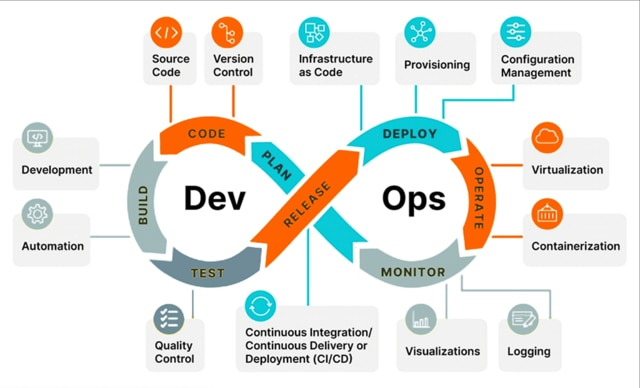

# DevOps

DevOPs es una filosofía y conjunto de prácticas que busca integrar los equipos de desarrollo de software (de ahí viene parte de la palabra que corresponde a Dev) y operaciones de tecnología (Ops).
El objetivo que tiene esta filosofía es mejorar la colaboración y aumentar la velocidad de desarrollo para que así afecte de manera positiva a las personas, a los procesos y a la tecnología.

**Índice**
1. [Filosofía](Filosofía.md)
2. [Herramientas](Herramientas.md)
3. [Oferta de empleo](Oferta.md)

**Referencia**

[DevOps](https://es.wikipedia.org/wiki/DevOps)

